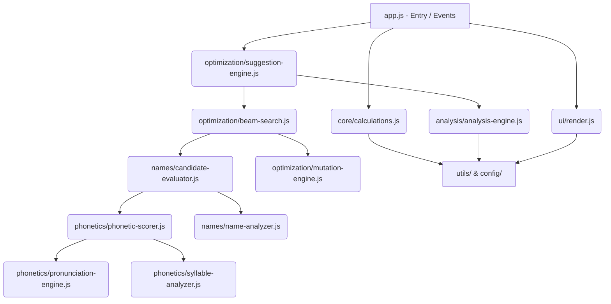

# Architecture: Numerology Studio

## 1. System Overview
Numerology Studio is a modular, client-side Single-Page Application (SPA). It takes user input (name, birth date), calculates core numerological values using the Chaldean system, and uses a heuristic search algorithm to suggest optimized spelling variations.

## 2. Module Relationships



## 3. Core Subsystems

### A. The Numerology Core (`js/core/`, `js/config/`)
Handles the fundamental math.
- **Chaldean System:** Converts letters to numbers based on specific vibrational frequencies (`chaldean-map.js`).
- **Calculations:** Mulank (Driver), Bhagyank (Destiny), Kua (Direction), and Master/Karmic number detection.

### B. The Optimization Engine (`js/optimization/`)
The "AI" of the application.
- **Algorithm:** Uses **Beam Search** (`beam-search.js`) to explore name variations.
- **Mutations:** Generates spelling tweaks (e.g., adding/removing letters) via `mutation-engine.js`.
- **Ranking:** Candidates are evaluated against the user's base profile and ranked.

### C. The Phonetic Filter (`js/phonetics/`)
Acts as a constraint on the Optimization Engine.
- **Goal:** Prevents the engine from suggesting mathematically perfect but unpronounceable names (e.g., "Jjjohn").
- **Metrics:** Analyzes syllables, readability, and cultural alignment.

### D. The Validator (`js/validator/`)
Allows users to bypass the engine and test their own manual spelling variations, comparing them against the original name.

### E. The UI Layer (`js/ui/`)
- **Rendering:** `render.js` manages complex DOM string generation.
- **Theming:** `theme.js` toggles between light and dark modes utilizing root CSS variables.

## 4. Critical Data Structures

### The `Reading` Object
Generated by `calculateReading` and stored in `localStorage`.
```javascript
{
  id: "timestamp",
  name: "John Doe",
  birthDate: "1990-01-01",
  gender: "male",
  mulank: 1,
  bhagyank: 2,
  kua: 1,
  nameNumber: 5,
  // ... plus Karmic/Master flags and Challenge numbers
}
```

### The `Candidate` Evaluation Object
Generated during Beam Search.
```javascript
{
  name: "Johnn Doe",
  total: 41,
  reduced: 5,
  score: 85,
  reasons: ["Natural pronunciation", "Harmonizes with Mulank"],
  warnings: ["High phonetic drift"],
  // ... phonetics metadata
}
```
